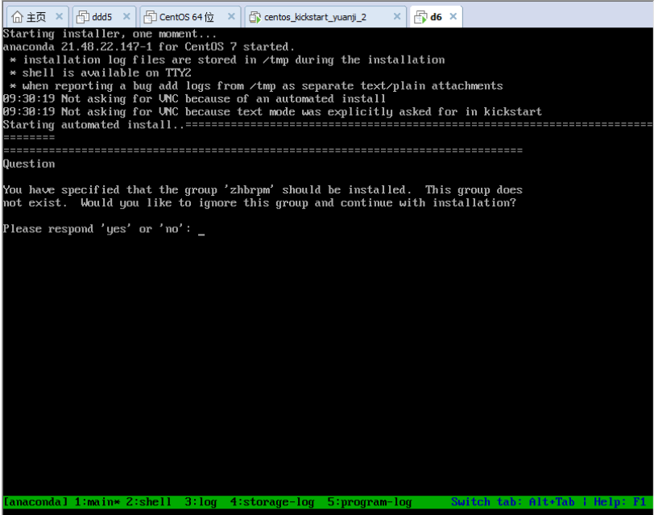
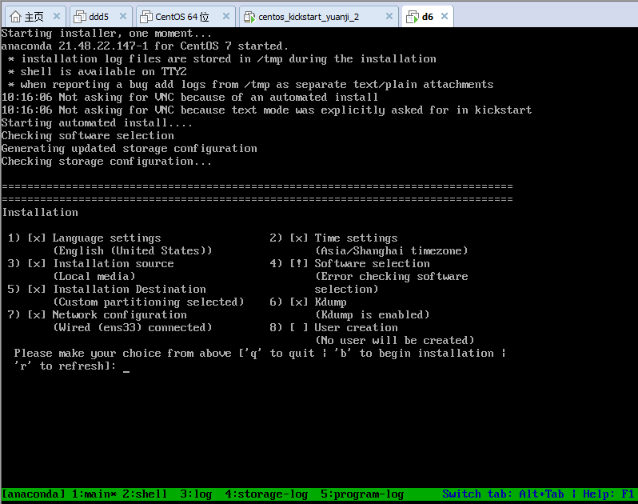
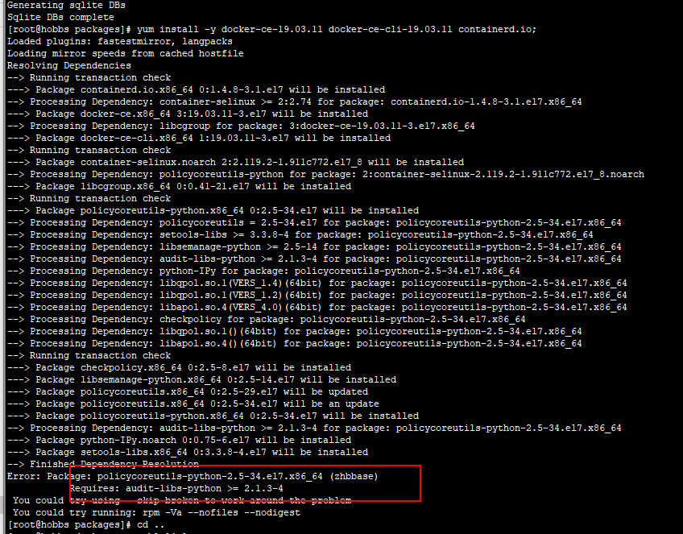
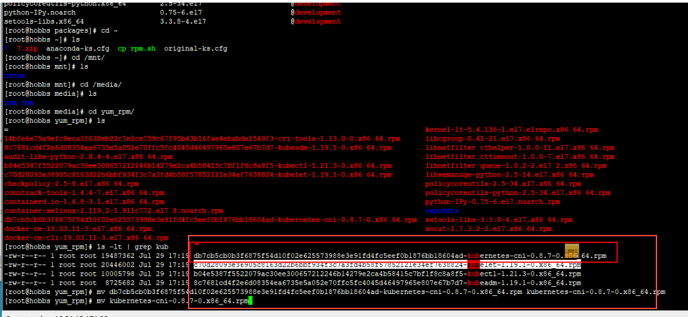

# 一 基于DHCP+tftp+http+pxe+ks安装系统

## 1.1 centos系统光盘的构成

**EFI:** 这是支持EFI分区所要使用的引导程序

**images:** 存放在用于基于网络方式安装系统时侯所用到的引导程序

​        **efiboot.img**

​		**efidsik.img** 用于支持EFI引导系统所用的引导文件和磁盘文件

​		**pxeboot** 存放用于构建基于内存的操作的系统的内核的根目录文件

​						initrd.img  vmlinuz

**isolinux:** 本地或者自动安装系统用到该目录下的文件

​		**vmlinuz  initrd.img**

## 1.2 基于pxe方式安装系统需要的组件

**1 vmlinuz和initrd文件**

​		系统光盘

​				光盘目录下的 images/pxeboot/{vminuz, initrd.img}

**2 光盘界面相关的文件**

​		vesamenu.c32

​		splash.jpg

​		系统光盘

​				光盘目录下的 isolunux下的有这三个文件

**3 pxelinux.0**

​		基于网络安装系统的过程中，起到和bootloader类似的功能，在软件包syslinux中，只需要安装软件yum install syslinux 即可拿到pxelinux.0

**4 isolinux.cfg**

​		系统光盘

​				光盘目录下的isolinux下有这个文件。这个我不能放置在 /var/lib/tftpboot下，需要放置在/var/lib/tftpboot下名为isolinux.cfg目录中，而且该文件需要改名为default


##  1.3 配置dhcp

```
关闭防火墙:
    systemctl disable firewalld.service  
    systemctl stop firewalld.service 

关闭selinux: 
	vim /etc/selinux/config   SELINUX=disabled
    setenforce 0
    getenforce

安装dhcp
    yum install dhcp* -y

配置dhcp
	vim /etc/dhcp/dhcpd.conf

    ddns-update-style interim;
    ignore client-updates;
    next-server 10.51.15.234;
    filename "pxelinux.0";
    allow booting;
    allow bootp;
    subnet 10.51.15.0 netmask 255.255.255.0 {
    option routers 10.51.15.254;
    option subnet-mask 255.255.255.0;
    range dynamic-bootp 10.51.15.207 10.51.15.250;

    }
	
    chkconfig dhcpd on 
    systemctl start dhcpd 

```

配置到这一步，客户端就可以动态获取到ip地址了

##  1.4 配置tftp

```
1 安装tftp
	yum install tftp tftp-server xintd -y
2 配置tftp
    service tftp
    {
            socket_type             = dgram
            protocol                = udp
            wait                    = yes
            user                    = root
            server                  = /usr/sbin/in.tftpd
            server_args             = -u nobody -s /var/lib/tftpboot #改这行
            disable                 = no                       #改这行
            per_source              = 11
            cps                     = 100 2
            flags                   = IPv4
    }
	
2 启动
	service xinetd restart
    service tftp restart
	chkconfig xinetd on
	chkconfig tftp on
	chkconfig --list | grep tftp

3 准备bootloader
	yum install syslinux syslinux-devel -y
	ls /usr/share/syslinux/pxelinux.0
	
4 准备配置文件
	mkdir /var/lib/tftpboot/pxelinux.cfg
	cp /mnt/isolinux/isolinux.cfg  /var/lib/tftpboot/pxelinux.cfg/default


5 修改dhcp配置文件，实现告知客户端tftp的地址
	vim /etc/dhcp/dhcpd.conf
	
    ddns-update-style interim;
    ignore client-updates;
    next-server 10.51.15.234;
    filename "pxelinux.0";
    allow booting;
    allow bootp;
    subnet 10.51.15.0 netmask 255.255.255.0 {
    option routers 10.51.15.254;
    option subnet-mask 255.255.255.0;
    range dynamic-bootp 10.51.15.207 10.51.15.250;

    }
	service dhcpd restart
	service xined restart
```

至此客户端就能连上tftp了

cp /mnt/cdrom/isolinux/vesamenu.c32 /var/lib/tftpboot

cp /mnt/cdrom/isolinux/vmlinuz /var/lib/tftpboot

cp /mnt/cdrom/isolinux/initrd.img /var/lib/tftpboot


修改default

```
default vesamenu.c32
timeout 10

display boot.msg

menu clear
menu background splash.png
menu title CentOS 7

label linux
  menu label ^Install CentOS 7
  menu default
  kernel vmlinuz
  append initrd=initrd.img inst.repo=http://10.51.15.234/centos7 quiet ks=http://10.51.15.234/ks66.cfg


```

## 1.5 配置http

```
yum install -y httpd-devel
systemctl start httpd
mount /dev/cdrom /var/www/html

```

## 1.6 写ks脚本

**基本的配置脚本**

vim /var/www/html/ks.cfg

```
install
text
keyboard 'us'
rootpw 123
timezone Asia/Shanghai
url --url=http://10.51.15.234/centos7
lang zh_CN
firewall --disable
selinux --disable
network --bootproto=dhcp --device=ens33
auth --useshadow --passalgo=sha512
firstboot --disable
bootloader --location=mbr
clearpart --all --initlabel
part /boot --fstype="ext4" --size=500
part / --fstype="ext4" --grow
part swap --fstype="swap" --size=1024
reboot
%packages
@base
@core
%end
%pre  安装前

%end

%post 安装后

%end


install       	需要做什么
text          	文本的方式
keyboard 'us' 	美式键盘
rootpw 123		使用root密码
timezone Asia/Shanghai 设置时区
url --url=http://10.51.15.234/centos7 去找镜像的地址，告诉kickstart去这里找
lang zh_CN  语言
firewall --disable 关闭防火墙
selinux --disable 关闭selinux
network --bootproto=dhcp --device=ens33
auth --useshadow --passalgo=sha512
firstboot --disable
bootloader --location=mbr
clearpart --all --initlabel
part /boot --fstype="ext4" --size=500  分区
part / --fstype="ext4" --grow
part swap --fstype="swap" --size=1024
reboot
%packages
@base
@core
%end
```

## 坑点

这里我只列举部分坑点

报错: no space left.........

开始以为是我的虚拟机设置的硬盘空间太小，后面发现是内存空间太小了


# 二 定制iso镜像制作

## **2.1 挂载**

```

	mount /dev/cdrom /zhbapp/cdrom
	rsync -a -exclude=Packages/ -exclude=repodata/ /mnt/cdrom /zhbapp/cdrom
    注意，iso里面是有隐藏文件的，一定要将所有文件拷贝到新建目录，使用此命令可以拷贝所有文件包含隐藏文件。


常见文件目录用途说明：
isolinux目录存放光盘启动时的安装界面信息
images目录包括了必要的启动映像文件
Packages目录存放安装软件包及信息
repodata目录存放rpm包依赖信息
.discinfo文件是安装介质的识别信息
```

## **2.2 写ks脚本**

```
install
cdrom
text
firstboot --enable
lang en_US.UTF-8
keyboard 'us'
zerombr
rootpw 123
timezone Asia/Shanghai

keyboard --vckeymap=us --xlayouts='us'

firewall --disable
selinux --disable
network  --bootproto=dhcp --device=ens33 --onboot=yes --ipv6=auto --activate
network  --hostname=hobbs.com

auth --useshadow --passalgo=sha512
bootloader --append=" crashkernel=auto" --location=mbr --boot-drive=sda
clearpart --none --initlabel
part /boot --fstype="xfs" --ondisk=sda --size=200
part pv.316 --fstype="lvmpv" --ondisk=sda --size=12296
volgroup centos --pesize=4096 pv.316
logvol /  --fstype="xfs" --size=10240 --name=root --vgname=centos
logvol swap  --fstype="swap" --size=2048 --name=swap --vgname=centos

reboot
%packages
@base
@core
lrzsz
createrepo
nmap
sysstat
dos2unix
telnet
%end

%post
mkdir -p /media/yum_rpm
cat> /etc/yum.repos.d/dvd.repo << END
[development]
name=rhel7
baseurl=file:///media/yum_rpm/
enabled=1
gpgcheck=0
END
mkdir -p /etc/yum.repos.d/bak
mv /etc/yum.repos.d/C* /etc/yum.repos.d/bak -f
yum clean all
createrepo -pdo /media/yum_rpm/ /media/yum_rpm/
createrepo --update /media/yum_rpm/
echo "hello dddddddddd" > /etc/dddd
yum install -y docker-ce-19.03.11 docker-ce-cli-19.03.11 containerd.io
systemctl start docker
systemctl enable docker
sed -i "s/ExecStart=\/usr\/bin\/dockerd -H fd:\/\/ --containerd=\/run\/containerd\/containerd.sock/ExecStart=\/usr\/bin\/dockerd -H fd:\/\/ --containerd=\/run\/containerd\/containerd.sock -H unix:\/\/var\/run\/docker.sock/g" /lib/systemd/system/docker.service
systemctl daemon-reload
systemctl restart docker
yum install -y kubelet-1.19.1-0 kubeadm-1.19.1-0 kubectl-1.19.1.-0
systemctl daemon-reload
systemctl restart kubelet.service
systemctl enable kubelet.service
mkdir -p /mnt/cdrom
mount /dev/cdrom /mnt/cdrom/
%end


```

## 2.3 编辑isolinux.cfg

编辑 /zhbapp/cdrom/isolinux/isolinux.cfg 将启动指向我们的ks脚本

```

default vesamenu.c32
timeout 10

display boot.msg

menu clear
menu background splash.png
menu title CentOS 7

label linux
  menu label ^Install CentOS 7
  kernel vmlinuz
  append ks=cdrom:/isolinux/ks.cfg initrd=initrd.img
```

## 2.4 收集rpm包

```

cp /mnt/repodata/4df092633ebecaeebdd78359a11a3c13f619f22605322e15e5e307beebd8e641-c6-x86_64-comps.xml comps.xml

createrepo -g comps.xml .

```

## 2.5 本地yum源ks脚本书写

```
install
cdrom
text
firstboot --enable
lang en_US.UTF-8
keyboard 'us'
zerombr
rootpw 123
timezone Asia/Shanghai

keyboard --vckeymap=us --xlayouts='us'

firewall --disable
selinux --disable
network  --bootproto=dhcp --device=ens33 --onboot=yes --ipv6=auto --activate
network  --hostname=hobbs.com

auth --useshadow --passalgo=sha512
bootloader --append=" crashkernel=auto" --location=mbr --boot-drive=sda
clearpart --none --initlabel
part /boot --fstype="xfs" --ondisk=sda --size=200
part pv.316 --fstype="lvmpv" --ondisk=sda --size=12296
volgroup centos --pesize=4096 pv.316
logvol /  --fstype="xfs" --size=10240 --name=root --vgname=centos
logvol swap  --fstype="swap" --size=2048 --name=swap --vgname=centos

reboot
%packages
@base
@core
lrzsz
createrepo
%end

%post
mkdir -p /media/yum_rpm
cat> /etc/yum.repos.d/zhbbase.repo << END
[zhbbase]
name=rhel7
baseurl=file:///media/yum_rpm/7/base
enabled=1
gpgcheck=0
END
cat> /etc/yum.repos.d/zhbextras.repo << END
[zhbextras]
name=rhel7
baseurl=file:///media/yum_rpm/7/extras
enabled=1
gpgcheck=0
END
cat> /etc/yum.repos.d/zhbdocker-ce-stable << END
[zhbdocker-ce-stable]
name=rhel7
baseurl=file:///media/yum_rpm/7/docker-ce-stable
enabled=1
gpgcheck=0
gpgcheck=0
END
cat> /etc/yum.repos.d/zhbdevelopment.repo << END
[zhbdevelopment]
name=rhel7
baseurl=file:///media/yum_rpm/7/development
enabled=1
gpgcheck=0
END
cat> /etc/yum.repos.d/zhbepel.repo << END
[zhbepel]
name=rhel7
baseurl=file:///media/yum_rpm/7/epel
enabled=1
gpgcheck=0
END
cat> /etc/yum.repos.d/zhbkubernetes.repo << END
[zhbkubernetes]
name=rhel7
baseurl=file:///media/yum_rpm/7/kubernetes
enabled=1
gpgcheck=0
END
cat> /etc/yum.repos.d/elrepo-kernel.repo << END
[elrepo-kernel]
name=rhel7
baseurl=file:///media/yum_rpm/7/elrepo-kernel
enabled=1
gpgcheck=0
END
cat> /etc/yum.repos.d/zhbdvd.repo << END
[zhbdvd]
name=rhel7
baseurl=file:///media/yum_rpm
enabled=1
gpgcheck=0
END


mkdir -p /etc/yum.repos.d/bak
mv /etc/yum.repos.d/C* /etc/yum.repos.d/bak -f


mkdir -p /mnt/cdrom
mount /dev/cdrom /mnt/cdrom/
/usr/bin/cp /mnt/cdrom/Zhbrpm/* /media/yum_rpm/ -rf
createrepo /media/yum_rpm/7/base
createrepo /media/yum_rpm/7/extras
createrepo /media/yum_rpm/7/docker-ce-stable
createrepo /media/yum_rpm/7/development
createrepo /media/yum_rpm/7/kubernetes
createrepo /media/yum_rpm/7/elrepo-kernel
createrepo /media/yum_rpm/7/epel
createrepo /media/yum_rpm/
yum clean all
rpm -ivh /media/yum_rpm/7/base/packages/audit-libs-python-2.8.4-4.el7.x86_64.rpm 
echo "hello dddddddddd" > /etc/dddd
yum install -y docker-ce-19.03.11 docker-ce-cli-19.03.11 containerd.io
systemctl start docker
systemctl enable docker
sed -i "s/ExecStart=\/usr\/bin\/dockerd -H fd:\/\/ --containerd=\/run\/containerd\/containerd.sock/ExecStart=\/usr\/bin\/dockerd -H fd:\/\/ --containerd=\/run\/containerd\/containerd.sock -H unix:\/\/var\/run\/docker.sock/g" /lib/systemd/system/docker.service
systemctl daemon-reload
systemctl restart docker

yum install -y kubelet-1.19.1-0 kubeadm-1.19.1-0 kubectl-1.19.1.-0
systemctl daemon-reload
systemctl restart kubelet.service
systemctl enable kubelet.service

%end

```


## 坑点

这里我只列举部分坑点

### 1 找不到group



```
如上图: 使用https://www.cnblogs.com/weibin1/p/10522024.html的方法定制rpm包到镜像中的时候，采用各种方式都式了，上图报group不存在，后面使用这篇博客中的将安装包配置到core或者别的下面，还是不行。直接放到core目录下面，会出现坑点2的问题

```

### 2 卡在安装选择界面



```
如上图: ks脚本写了语言各种配置都写好了，但是还是卡在了这个界面，后面去掉一些安装包，就好了

```

### 3 本地yum源坑点

刚开始本来不想采用将rpm拷贝出来放到主机中的方式，而是采用 https://www.cnblogs.com/weibin1/p/10522024.html 中的定制rpm，因为这种方式看起来更简单，但按这种操作，始终搞不好，没办法只能走在脚本中写搭建本地yum源的方法

走本地yum源，碰到如下坑点

#### yum源坑点1




将所有的依赖rpm包都放到本地yum源下，装docker的时候还是报了这个错，手动安装这个rpm包 rpm -ivh audit-libs-python-2.8.4-4.el7.x86_64.rpm ，然后再yum docker ........ 就好了

#### yum源坑点2




将所有的rpm包放到同一个目录，创建本地yum源，包上面的错误。 后面干脆直接将 yum源cache里的整个目录打包，创建多个yum源，分别指到不同的packages目录解决，具体可以看ks脚本中


